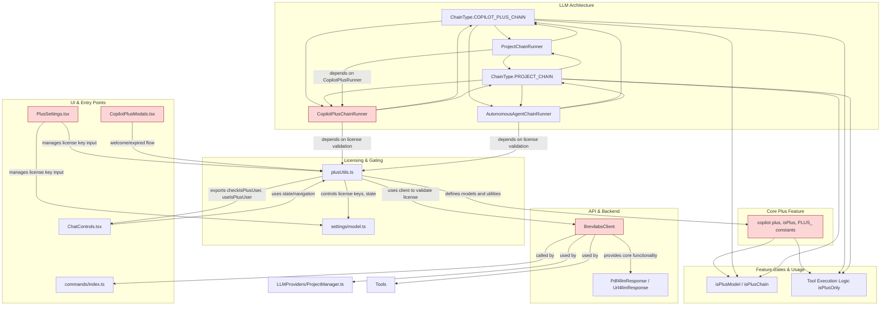

# Dependency Mappings

## Critical Dependencies by Function

```mermaid
graph TD
    subgraph Core Plus Feature
        C0[copilot plus, isPlus, PLUS_ constants]
    end

    subgraph Licensing & Gating
        A[plusUtils.ts]
        B[settings/model.ts]
    end

    subgraph API & Backend
        D[BrevilabsClient]
        E[Pdf4llmResponse / Url4llmResponse]
    end

    subgraph LLM Architecture
        F[ChainType.COPILOT_PLUS_CHAIN]
        G[ChainType.PROJECT_CHAIN]
        H[CopilotPlusChainRunner]
        I[AutonomousAgentChainRunner]
        J[ProjectChainRunner]
    end

    subgraph UI & Entry Points
        K[ChatControls.tsx]
        L[PlusSettings.tsx]
        M[CopilotPlusModals.tsx]
        N[commands/index.ts]
    end

    subgraph Feature Gates & Usage
        O[isPlusModel / isPlusChain]
        P[Tool Execution Logic isPlusOnly]
    end

    A -- controls license keys, state --> B
    A -- exports checkIsPlusUser, useIsPlusUser --> K
    A -- defines models and utilities --> C0
    A -- uses client to validate license --> D
    K -- uses state/navigation --> A
    L -- manages license key input --> A & B
    M -- welcome/expired flow --> A

    F & G --> J & H & I
    H & I & J --> F & G
    H & I -- depends on license validation --> A
    J -- depends on CopilotPlusRunner --> H

    D -- provides core functionality --> E
    D -- called by --> N
    D -- used by --> LLMProviders/ProjectManager.ts
    D -- used by --> Tools

    C0 & F & G --> O & P

    style C0 fill:#fcd6d6,stroke:#8e0000
    style D fill:#fcd6d6,stroke:#8e0000
    style H fill:#fcd6d6,stroke:#8e0000
    style M fill:#fcd6d6,stroke:#8e0000
    style L fill:#fcd6d6,stroke:#8e0000
```
