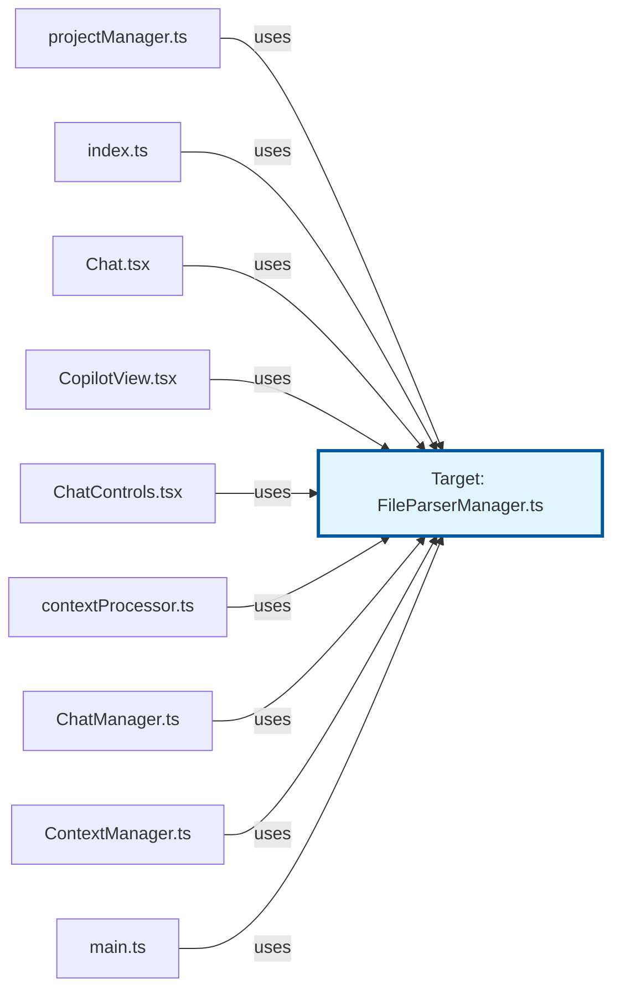
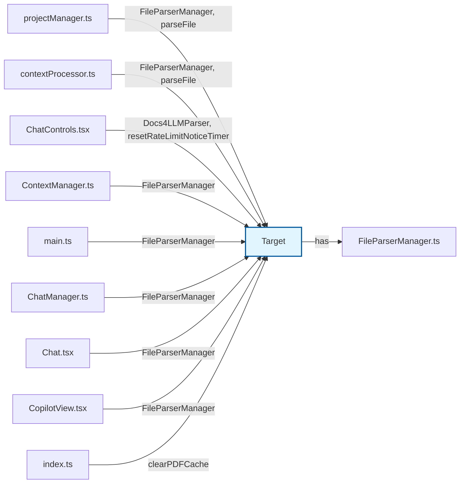
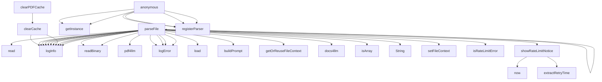

# Code Analysis Report: src/tools/FileParserManager.ts

Generated: 2025-10-22T20:06:05.518Z

## Quick Reference

**Top Symbols (by importance):**

1. **FileParserManager** (score: 90) - 20 refs, 7 files, 53 LOC
2. **parseFile** (score: 48) - 4 refs, 2 files, 91 LOC
3. **parseFile** (score: 37) - 4 refs, 2 files, 22 LOC
4. **Docs4LLMParser** (score: 34) - 2 refs, 1 files, 237 LOC
5. **parseFile** (score: 33) - 4 refs, 2 files, 13 LOC

**Dependencies:** 9 files depend on this target

## Summary

- **Target**: `src/tools/FileParserManager.ts`
- **Exclude Stdlib**: true
- **Target Symbols**: 37
- **Inbound References**: 31
- **Outbound References**: 122
- **Function Calls**: 38

## Target Symbols (Ranked by Importance)

| Rank | Name                      | Kind                 | Score | Refs | Files | LOC | Locations                                                                                                                                                                       |
| ---- | ------------------------- | -------------------- | ----- | ---- | ----- | --- | ------------------------------------------------------------------------------------------------------------------------------------------------------------------------------- |
| 1    | FileParserManager         | ClassDeclaration     | 90    | 20   | 7     | 53  | src/tools/FileParserManager.ts:329                                                                                                                                              |
| 2    | parseFile                 | MethodDeclaration    | 48    | 4    | 2     | 91  | src/tools/FileParserManager.ts:202, src/tools/FileParserManager.ts:33, src/tools/FileParserManager.ts:65, src/tools/FileParserManager.ts:363, src/tools/FileParserManager.ts:18 |
| 3    | Docs4LLMParser            | ClassDeclaration     | 34    | 2    | 1     | 237 | src/tools/FileParserManager.ts:80                                                                                                                                               |
| 4    | supportsExtension         | MethodDeclaration    | 25    | 3    | 2     | 3   | src/tools/FileParserManager.ts:371                                                                                                                                              |
| 5    | resetRateLimitNoticeTimer | MethodDeclaration    | 21    | 1    | 1     | 3   | src/tools/FileParserManager.ts:192                                                                                                                                              |
| 6    | PDFParser                 | ClassDeclaration     | 15    | 0    | 0     | 38  | src/tools/FileParserManager.ts:23                                                                                                                                               |
| 7    | clearPDFCache             | MethodDeclaration    | 12    | 1    | 1     | 6   | src/tools/FileParserManager.ts:375                                                                                                                                              |
| 8    | CanvasParser              | ClassDeclaration     | 7     | 0    | 0     | 17  | src/tools/FileParserManager.ts:62                                                                                                                                               |
| 9    | showRateLimitNotice       | MethodDeclaration    | 7     | 0    | 0     | 17  | src/tools/FileParserManager.ts:294                                                                                                                                              |
| 10   | MarkdownParser            | ClassDeclaration     | 3     | 0    | 0     | 7   | src/tools/FileParserManager.ts:15                                                                                                                                               |
| 11   | FileParser                | InterfaceDeclaration | 2     | 0    | 0     | 4   | src/tools/FileParserManager.ts:10                                                                                                                                               |
| 12   | clearCache                | MethodDeclaration    | 2     | 0    | 0     | 4   | src/tools/FileParserManager.ts:56, src/tools/FileParserManager.ts:312                                                                                                           |
| 13   | cachedContent             | VariableDeclaration  | 2     | 0    | 0     | 4   | src/tools/FileParserManager.ts:213                                                                                                                                              |
| 14   | registerParser            | MethodDeclaration    | 2     | 0    | 0     | 5   | src/tools/FileParserManager.ts:357                                                                                                                                              |
| 15   | cachedResponse            | VariableDeclaration  | 0     | 0    | 0     | 1   | src/tools/FileParserManager.ts:38                                                                                                                                               |
| 16   | binaryContent             | VariableDeclaration  | 0     | 0    | 0     | 1   | src/tools/FileParserManager.ts:45, src/tools/FileParserManager.ts:227                                                                                                           |
| 17   | pdf4llmResponse           | VariableDeclaration  | 0     | 0    | 0     | 1   | src/tools/FileParserManager.ts:47                                                                                                                                               |
| 18   | error                     | VariableDeclaration  | 0     | 0    | 0     | 1   | src/tools/FileParserManager.ts:50, src/tools/FileParserManager.ts:73, src/tools/FileParserManager.ts:279                                                                        |
| 19   | canvasLoader              | VariableDeclaration  | 0     | 0    | 0     | 1   | src/tools/FileParserManager.ts:68                                                                                                                                               |
| 20   | canvasData                | VariableDeclaration  | 0     | 0    | 0     | 1   | src/tools/FileParserManager.ts:69                                                                                                                                               |
| 21   | docs4llmResponse          | VariableDeclaration  | 0     | 0    | 0     | 1   | src/tools/FileParserManager.ts:232                                                                                                                                              |
| 22   | content                   | VariableDeclaration  | 0     | 0    | 0     | 1   | src/tools/FileParserManager.ts:239                                                                                                                                              |
| 23   | markdownParts             | VariableDeclaration  | 0     | 0    | 0     | 1   | src/tools/FileParserManager.ts:244                                                                                                                                              |
| 24   | doc                       | VariableDeclaration  | 0     | 0    | 0     | 1   | src/tools/FileParserManager.ts:245                                                                                                                                              |
| 25   | now                       | VariableDeclaration  | 0     | 0    | 0     | 1   | src/tools/FileParserManager.ts:295                                                                                                                                              |
| 26   | retryTime                 | VariableDeclaration  | 0     | 0    | 0     | 1   | src/tools/FileParserManager.ts:304                                                                                                                                              |
| 27   | ext                       | VariableDeclaration  | 0     | 0    | 0     | 1   | src/tools/FileParserManager.ts:358                                                                                                                                              |
| 28   | parser                    | VariableDeclaration  | 0     | 0    | 0     | 1   | src/tools/FileParserManager.ts:364                                                                                                                                              |
| 29   | pdfParser                 | VariableDeclaration  | 0     | 0    | 0     | 1   | src/tools/FileParserManager.ts:376                                                                                                                                              |

## Target-Level Dependencies

High-level view of files that depend on the target and files the target depends on.

## Detailed Dependency Map

Detailed symbol-level dependencies (simplified to avoid redundant edges).

## Call Hierarchy

## References

Detailed inbound and outbound references have been written to a separate file.

**→ [View Detailed References](prompt-FileParserManager-references.md)**
