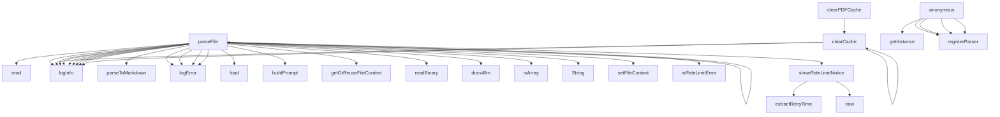

# Code Analysis Report: src/tools/FileParserManager.ts

Generated: 2025-10-23T16:34:12.398Z

## Quick Reference

**Top Symbols (by importance):**

1. **FileParserManager** (score: 90) - 20 refs, 7 files, 54 LOC
2. **parseFile** (score: 48) - 4 refs, 2 files, 91 LOC
3. **Docs4LLMParser** (score: 34) - 2 refs, 1 files, 237 LOC
4. **parseFile** (score: 33) - 4 refs, 2 files, 13 LOC
5. **parseFile** (score: 32) - 4 refs, 2 files, 11 LOC

**Dependencies:** 9 files depend on this target

## Summary

- **Target**: `src/tools/FileParserManager.ts`
- **Exclude Stdlib**: true
- **Target Symbols**: 36
- **Inbound References**: 31
- **Outbound References**: 110
- **Function Calls**: 35

## Target Symbols (Ranked by Importance)

| Rank | Name                      | Kind                 | Score | Refs | Files | LOC | Locations                                                                                                                                                                       |
| ---- | ------------------------- | -------------------- | ----- | ---- | ----- | --- | ------------------------------------------------------------------------------------------------------------------------------------------------------------------------------- |
| 1    | FileParserManager         | ClassDeclaration     | 90    | 20   | 7     | 54  | src/tools/FileParserManager.ts:312                                                                                                                                              |
| 2    | parseFile                 | MethodDeclaration    | 48    | 4    | 2     | 91  | src/tools/FileParserManager.ts:185, src/tools/FileParserManager.ts:48, src/tools/FileParserManager.ts:27, src/tools/FileParserManager.ts:347, src/tools/FileParserManager.ts:18 |
| 3    | Docs4LLMParser            | ClassDeclaration     | 34    | 2    | 1     | 237 | src/tools/FileParserManager.ts:63                                                                                                                                               |
| 4    | supportsExtension         | MethodDeclaration    | 25    | 3    | 2     | 3   | src/tools/FileParserManager.ts:355                                                                                                                                              |
| 5    | resetRateLimitNoticeTimer | MethodDeclaration    | 21    | 1    | 1     | 3   | src/tools/FileParserManager.ts:175                                                                                                                                              |
| 6    | clearPDFCache             | MethodDeclaration    | 12    | 1    | 1     | 6   | src/tools/FileParserManager.ts:359                                                                                                                                              |
| 7    | PDFParser                 | ClassDeclaration     | 8     | 0    | 0     | 21  | src/tools/FileParserManager.ts:23                                                                                                                                               |
| 8    | CanvasParser              | ClassDeclaration     | 7     | 0    | 0     | 17  | src/tools/FileParserManager.ts:45                                                                                                                                               |
| 9    | showRateLimitNotice       | MethodDeclaration    | 7     | 0    | 0     | 17  | src/tools/FileParserManager.ts:277                                                                                                                                              |
| 10   | MarkdownParser            | ClassDeclaration     | 3     | 0    | 0     | 7   | src/tools/FileParserManager.ts:15                                                                                                                                               |
| 11   | FileParser                | InterfaceDeclaration | 2     | 0    | 0     | 4   | src/tools/FileParserManager.ts:10                                                                                                                                               |
| 12   | clearCache                | MethodDeclaration    | 2     | 0    | 0     | 4   | src/tools/FileParserManager.ts:39, src/tools/FileParserManager.ts:295                                                                                                           |
| 13   | cachedContent             | VariableDeclaration  | 2     | 0    | 0     | 4   | src/tools/FileParserManager.ts:196                                                                                                                                              |
| 14   | registerParser            | MethodDeclaration    | 2     | 0    | 0     | 5   | src/tools/FileParserManager.ts:341                                                                                                                                              |
| 15   | entry                     | VariableDeclaration  | 0     | 0    | 0     | 1   | src/tools/FileParserManager.ts:31                                                                                                                                               |
| 16   | error                     | VariableDeclaration  | 0     | 0    | 0     | 1   | src/tools/FileParserManager.ts:33, src/tools/FileParserManager.ts:56, src/tools/FileParserManager.ts:262                                                                        |
| 17   | canvasLoader              | VariableDeclaration  | 0     | 0    | 0     | 1   | src/tools/FileParserManager.ts:51                                                                                                                                               |
| 18   | canvasData                | VariableDeclaration  | 0     | 0    | 0     | 1   | src/tools/FileParserManager.ts:52                                                                                                                                               |
| 19   | binaryContent             | VariableDeclaration  | 0     | 0    | 0     | 1   | src/tools/FileParserManager.ts:210                                                                                                                                              |
| 20   | docs4llmResponse          | VariableDeclaration  | 0     | 0    | 0     | 1   | src/tools/FileParserManager.ts:215                                                                                                                                              |
| 21   | content                   | VariableDeclaration  | 0     | 0    | 0     | 1   | src/tools/FileParserManager.ts:222                                                                                                                                              |
| 22   | markdownParts             | VariableDeclaration  | 0     | 0    | 0     | 1   | src/tools/FileParserManager.ts:227                                                                                                                                              |
| 23   | doc                       | VariableDeclaration  | 0     | 0    | 0     | 1   | src/tools/FileParserManager.ts:228                                                                                                                                              |
| 24   | now                       | VariableDeclaration  | 0     | 0    | 0     | 1   | src/tools/FileParserManager.ts:278                                                                                                                                              |
| 25   | retryTime                 | VariableDeclaration  | 0     | 0    | 0     | 1   | src/tools/FileParserManager.ts:287                                                                                                                                              |
| 26   | localPdfProcessor         | VariableDeclaration  | 0     | 0    | 0     | 1   | src/tools/FileParserManager.ts:325                                                                                                                                              |
| 27   | ext                       | VariableDeclaration  | 0     | 0    | 0     | 1   | src/tools/FileParserManager.ts:342                                                                                                                                              |
| 28   | parser                    | VariableDeclaration  | 0     | 0    | 0     | 1   | src/tools/FileParserManager.ts:348                                                                                                                                              |
| 29   | pdfParser                 | VariableDeclaration  | 0     | 0    | 0     | 1   | src/tools/FileParserManager.ts:360                                                                                                                                              |

## Target-Level Dependencies

High-level view of files that depend on the target and files the target depends on.

## Detailed Dependency Map

Detailed symbol-level dependencies (simplified to avoid redundant edges).

## Call Hierarchy

## References

Detailed inbound and outbound references have been written to a separate file.

**→ [View Detailed References](prompt-FileParserManager-references.md)**
