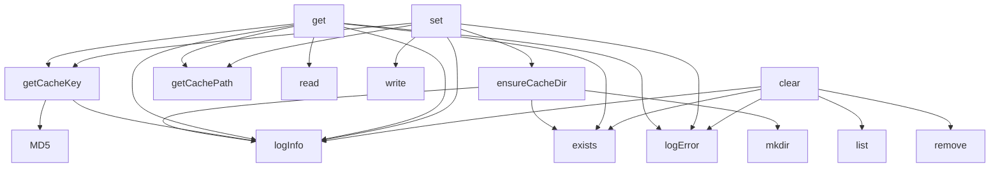

# Code Analysis Report: src/cache/pdfCache.ts

Generated: 2025-10-22T20:10:23.781Z

## Quick Reference

**Top Symbols (by importance):**

1. **PDFCache** (score: 38) - 3 refs, 1 files, 76 LOC
2. **get** (score: 17) - 1 refs, 1 files, 17 LOC
3. **clear** (score: 15) - 1 refs, 1 files, 13 LOC
4. **set** (score: 14) - 1 refs, 1 files, 11 LOC
5. **getInstance** (score: 12) - 1 refs, 1 files, 6 LOC

**Dependencies:** 1 files depend on this target

## Summary

- **Target**: `src/cache/pdfCache.ts`
- **Exclude Stdlib**: true
- **Target Symbols**: 20
- **Inbound References**: 7
- **Outbound References**: 67
- **Function Calls**: 23

## Target Symbols (Ranked by Importance)

| Rank | Name           | Kind                | Score | Refs | Files | LOC | Locations                                                                    |
| ---- | -------------- | ------------------- | ----- | ---- | ----- | --- | ---------------------------------------------------------------------------- |
| 1    | PDFCache       | ClassDeclaration    | 38    | 3    | 1     | 76  | src/cache/pdfCache.ts:6                                                      |
| 2    | get            | MethodDeclaration   | 17    | 1    | 1     | 17  | src/cache/pdfCache.ts:38                                                     |
| 3    | clear          | MethodDeclaration   | 15    | 1    | 1     | 13  | src/cache/pdfCache.ts:68                                                     |
| 4    | set            | MethodDeclaration   | 14    | 1    | 1     | 11  | src/cache/pdfCache.ts:56                                                     |
| 5    | getInstance    | MethodDeclaration   | 12    | 1    | 1     | 6   | src/cache/pdfCache.ts:12                                                     |
| 6    | getCacheKey    | MethodDeclaration   | 3     | 0    | 0     | 7   | src/cache/pdfCache.ts:26                                                     |
| 7    | ensureCacheDir | MethodDeclaration   | 2     | 0    | 0     | 6   | src/cache/pdfCache.ts:19                                                     |
| 8    | getCachePath   | MethodDeclaration   | 1     | 0    | 0     | 3   | src/cache/pdfCache.ts:34                                                     |
| 9    | metadata       | VariableDeclaration | 0     | 0    | 0     | 1   | src/cache/pdfCache.ts:28                                                     |
| 10   | key            | VariableDeclaration | 0     | 0    | 0     | 1   | src/cache/pdfCache.ts:29                                                     |
| 11   | cacheKey       | VariableDeclaration | 0     | 0    | 0     | 1   | src/cache/pdfCache.ts:40, src/cache/pdfCache.ts:59                           |
| 12   | cachePath      | VariableDeclaration | 0     | 0    | 0     | 1   | src/cache/pdfCache.ts:41, src/cache/pdfCache.ts:60                           |
| 13   | cacheContent   | VariableDeclaration | 0     | 0    | 0     | 1   | src/cache/pdfCache.ts:45                                                     |
| 14   | error          | VariableDeclaration | 0     | 0    | 0     | 1   | src/cache/pdfCache.ts:50, src/cache/pdfCache.ts:63, src/cache/pdfCache.ts:77 |
| 15   | files          | VariableDeclaration | 0     | 0    | 0     | 1   | src/cache/pdfCache.ts:71                                                     |
| 16   | file           | VariableDeclaration | 0     | 0    | 0     | 1   | src/cache/pdfCache.ts:73                                                     |

## Target-Level Dependencies

High-level view of files that depend on the target and files the target depends on.

## Detailed Dependency Map

Detailed symbol-level dependencies (simplified to avoid redundant edges).

## Call Hierarchy

## References

Detailed inbound and outbound references have been written to a separate file.

**→ [View Detailed References](prompt-pdfCache-references.md)**
