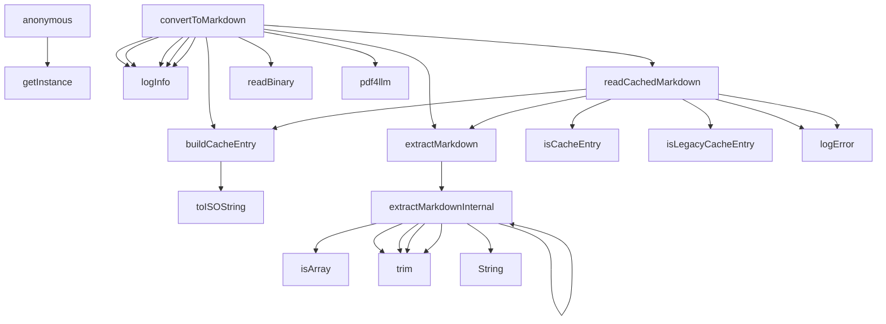

# Code Analysis Report: src/processors/pdfProcessor.ts

Generated: 2025-10-22T20:25:57.957Z

## Quick Reference

**Top Symbols (by importance):**

1. **PDFProcessor** (score: 42) - 4 refs, 1 files, 169 LOC
2. **convertToMarkdown** (score: 20) - 1 refs, 1 files, 26 LOC
3. **extractMarkdownInternal** (score: 19) - 0 refs, 0 files, 47 LOC
4. **clearCache** (score: 11) - 1 refs, 1 files, 3 LOC
5. **readCachedMarkdown** (score: 9) - 0 refs, 0 files, 23 LOC

**Dependencies:** 1 files depend on this target

## Summary

- **Target**: `src/processors/pdfProcessor.ts`
- **Exclude Stdlib**: true
- **Target Symbols**: 25
- **Inbound References**: 6
- **Outbound References**: 75
- **Function Calls**: 28

## Target Symbols (Ranked by Importance)

| Rank | Name                    | Kind                | Score | Refs | Files | LOC | Locations                                                            |
| ---- | ----------------------- | ------------------- | ----- | ---- | ----- | --- | -------------------------------------------------------------------- |
| 1    | PDFProcessor            | ClassDeclaration    | 42    | 4    | 1     | 169 | src/processors/pdfProcessor.ts:16                                    |
| 2    | convertToMarkdown       | MethodDeclaration   | 20    | 1    | 1     | 26  | src/processors/pdfProcessor.ts:29                                    |
| 3    | extractMarkdownInternal | MethodDeclaration   | 19    | 0    | 0     | 47  | src/processors/pdfProcessor.ts:118                                   |
| 4    | clearCache              | MethodDeclaration   | 11    | 1    | 1     | 3   | src/processors/pdfProcessor.ts:59                                    |
| 5    | readCachedMarkdown      | MethodDeclaration   | 9     | 0    | 0     | 23  | src/processors/pdfProcessor.ts:67                                    |
| 6    | buildCacheEntry         | MethodDeclaration   | 5     | 0    | 0     | 13  | src/processors/pdfProcessor.ts:94                                    |
| 7    | isLegacyCacheEntry      | MethodDeclaration   | 3     | 0    | 0     | 8   | src/processors/pdfProcessor.ts:176                                   |
| 8    | extractMarkdown         | MethodDeclaration   | 1     | 0    | 0     | 3   | src/processors/pdfProcessor.ts:111                                   |
| 9    | aggregated              | VariableDeclaration | 1     | 0    | 0     | 3   | src/processors/pdfProcessor.ts:156                                   |
| 10   | isCacheEntry            | MethodDeclaration   | 1     | 0    | 0     | 3   | src/processors/pdfProcessor.ts:169                                   |
| 11   | CACHE_VERSION           | VariableDeclaration | 0     | 0    | 0     | 1   | src/processors/pdfProcessor.ts:11                                    |
| 12   | cachedPayload           | VariableDeclaration | 0     | 0    | 0     | 1   | src/processors/pdfProcessor.ts:32                                    |
| 13   | cachedMarkdown          | VariableDeclaration | 0     | 0    | 0     | 1   | src/processors/pdfProcessor.ts:34                                    |
| 14   | binaryContent           | VariableDeclaration | 0     | 0    | 0     | 1   | src/processors/pdfProcessor.ts:44                                    |
| 15   | pdfResponse             | VariableDeclaration | 0     | 0    | 0     | 1   | src/processors/pdfProcessor.ts:45                                    |
| 16   | markdown                | VariableDeclaration | 0     | 0    | 0     | 1   | src/processors/pdfProcessor.ts:47, src/processors/pdfProcessor.ts:77 |
| 17   | cacheEntry              | VariableDeclaration | 0     | 0    | 0     | 1   | src/processors/pdfProcessor.ts:48                                    |
| 18   | upgradedEntry           | VariableDeclaration | 0     | 0    | 0     | 1   | src/processors/pdfProcessor.ts:78                                    |
| 19   | error                   | VariableDeclaration | 0     | 0    | 0     | 1   | src/processors/pdfProcessor.ts:81                                    |
| 20   | recordSource            | VariableDeclaration | 0     | 0    | 0     | 1   | src/processors/pdfProcessor.ts:135                                   |
| 21   | priorityKeys            | VariableDeclaration | 0     | 0    | 0     | 1   | src/processors/pdfProcessor.ts:141                                   |
| 22   | key                     | VariableDeclaration | 0     | 0    | 0     | 1   | src/processors/pdfProcessor.ts:142                                   |
| 23   | value                   | VariableDeclaration | 0     | 0    | 0     | 1   | src/processors/pdfProcessor.ts:143                                   |
| 24   | nested                  | VariableDeclaration | 0     | 0    | 0     | 1   | src/processors/pdfProcessor.ts:149                                   |

## Target-Level Dependencies

High-level view of files that depend on the target and files the target depends on.

## Detailed Dependency Map

Detailed symbol-level dependencies (simplified to avoid redundant edges).

## Call Hierarchy

## References

Detailed inbound and outbound references have been written to a separate file.

**→ [View Detailed References](prompt-pdfProcessor-references.md)**
