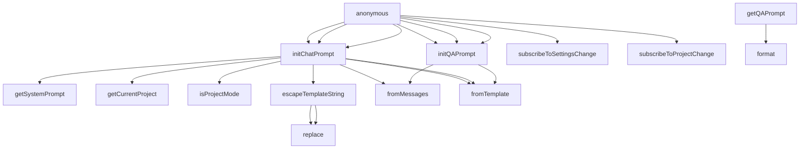

# Code Analysis Report: src/LLMProviders/promptManager.ts

Generated: 2025-10-23T16:46:24.663Z

## Quick Reference

**Top Symbols (by importance):**

1. **PromptManager** (score: 38) - 3 refs, 1 files, 85 LOC
2. **getInstance** (score: 12) - 1 refs, 1 files, 6 LOC
3. **getChatPrompt** (score: 11) - 1 refs, 1 files, 3 LOC
4. **initChatPrompt** (score: 7) - 0 refs, 0 files, 17 LOC
5. **getQAPrompt** (score: 6) - 0 refs, 0 files, 16 LOC

**Dependencies:** 1 files depend on this target

## Summary

- **Target**: `src/LLMProviders/promptManager.ts`
- **Exclude Stdlib**: true
- **Target Symbols**: 12
- **Inbound References**: 5
- **Outbound References**: 31
- **Function Calls**: 20

## Target Symbols (Ranked by Importance)

| Rank | Name                 | Kind                | Score | Refs | Files | LOC | Locations                            |
| ---- | -------------------- | ------------------- | ----- | ---- | ----- | --- | ------------------------------------ |
| 1    | PromptManager        | ClassDeclaration    | 38    | 3    | 1     | 85  | src/LLMProviders/promptManager.ts:10 |
| 2    | getInstance          | MethodDeclaration   | 12    | 1    | 1     | 6   | src/LLMProviders/promptManager.ts:30 |
| 3    | getChatPrompt        | MethodDeclaration   | 11    | 1    | 1     | 3   | src/LLMProviders/promptManager.ts:74 |
| 4    | initChatPrompt       | MethodDeclaration   | 7     | 0    | 0     | 17  | src/LLMProviders/promptManager.ts:37 |
| 5    | getQAPrompt          | MethodDeclaration   | 6     | 0    | 0     | 16  | src/LLMProviders/promptManager.ts:78 |
| 6    | initQAPrompt         | MethodDeclaration   | 5     | 0    | 0     | 13  | src/LLMProviders/promptManager.ts:55 |
| 7    | qaTemplate           | VariableDeclaration | 3     | 0    | 0     | 7   | src/LLMProviders/promptManager.ts:56 |
| 8    | promptResult         | VariableDeclaration | 2     | 0    | 0     | 5   | src/LLMProviders/promptManager.ts:87 |
| 9    | escapeTemplateString | MethodDeclaration   | 1     | 0    | 0     | 3   | src/LLMProviders/promptManager.ts:70 |
| 10   | systemPrompt         | VariableDeclaration | 0     | 0    | 0     | 1   | src/LLMProviders/promptManager.ts:38 |
| 11   | currentProject       | VariableDeclaration | 0     | 0    | 0     | 1   | src/LLMProviders/promptManager.ts:40 |
| 12   | escapedSystemMessage | VariableDeclaration | 0     | 0    | 0     | 1   | src/LLMProviders/promptManager.ts:46 |

## Target-Level Dependencies

High-level view of files that depend on the target and files the target depends on.

## Detailed Dependency Map

Detailed symbol-level dependencies (simplified to avoid redundant edges).

## Call Hierarchy

## References

Detailed inbound and outbound references have been written to a separate file.

**→ [View Detailed References](prompt-promptManager-references.md)**
